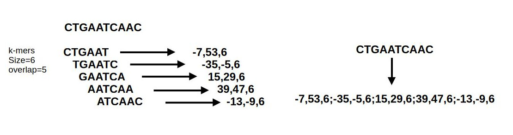
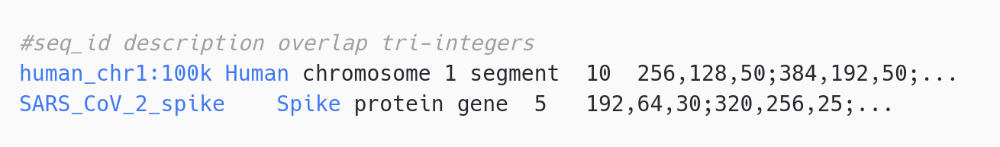

# Summary

Computational analysis of DNA sequences underpins numerous bioinformatics applications, including sequence classification, genome comparison, mutation detection, and evolutionary studies. These tasks often require transforming symbolic nucleotide sequences (A, T, C, G) into numerical representations suitable for mathematical processing or machine learning [@greener_guide_2022]. Chaos Game Representation (CGR) is a well-established method that encodes DNA sequences as points in a 2D space, revealing motifs and structural patterns [@jeffrey_chaos_1990]. However, traditional CGR depends on floating-point arithmetic, leading to rounding errors and imprecision, especially when applied to long sequences or tasks that require exact sequence reconstruction. `chaoscoder` implements the Integer Chaos Game Representation (iCGR), a variant that operates entirely in integer space to provide lossless encoding and decoding [@yin_encoding_2018]. To address the exponential scaling limitation of iCGR, the software introduces a block-based variant that divides sequences into overlapping segments, enabling scalable and parallelizable encoding of genome-length sequences. The software provides a command-line interface for encoding, decoding, visualizing CGRs, and comparing sequence structure via image-based SSIM (Structural Similarity Index Measure) [@wang_image_2004]. It supports standardized storage of encoded data in a custom `.bicgr` file format, designed for efficient downstream use.

# Statement of need

The exponential growth of genomic datasets necessitates robust, scalable, and reversible methods for DNA sequence encoding that can support downstream computational workflows. Among existing approaches, CGR has been widely adopted for its ability to visualize and analyze nucleotide composition in a geometric framework [@almeida_analysis_2001]. However, CGR suffers from inherent limitations: it relies on floating-point arithmetic, which introduces precision errors, lacks scalability to large sequences, and is not reversible, making exact sequence reconstruction impossible. The Integer Chaos Game Representation introduced by Yin *et al.* [@yin_encoding_2018], addresses these shortcomings by providing a mathematically rigorous and fully reversible encoding scheme based on integer arithmetic. Despite its theoretical advantages, iCGR remains underutilized due to the absence of a comprehensive, open-source implementation suitable for genome-scale applications. Apart from the illustrative prototype provided by the original authors, no available software supports full encoding, decoding, and standardized storage of iCGR coordinates in a format adapted to large-scale, reproducible workflows.
This software fills that gap by offering a modular, high-performance implementation of iCGR. It introduces a block-based strategy capable of handling arbitrarily long sequences through segmented and overlapping encoding, ensuring both scalability and reversibility. `chaoscoder` includes efficient utilities for encoding, decoding, and storing sequences in a structured format that is suitable for integration into bioinformatics pipelines [@chicco_ten_2017].

# Implementation

## Encoding and decoding DNA sequences by integer CGR

`chaoscoder` provides a CLI to encode and decode DNA sequences using the iCGR algorithm proposed by Yin [@yin_encoding_2018]. For sequences shorter than 100 nucleotides, the classic iCGR approach is used, mapping each base to integer coordinates without rounding errors.

## Block-based encoding

Due to the exponential nature of coordinate growth in iCGR, encoding long sequences (e.g., full genomes) directly is computationally infeasible. To mitigate this, `chaoscoder` implements a block-based iCGR approach. Sequences are partitioned into fixed-size, overlapping segments (e.g., 50–100 nt), each of which is independently encoded using the iCGR algorithm (Figure 1).

The result is a scalable encoding strategy that maintains the reversibility and precision of iCGR while enabling genome-scale processing.

## The `.bicgr` file format

The block-based integer Chaos Game Representation (.bicgr) format is a custom tab-separated file structure (Figure 2).

It includes the sequence ID (mandatory), the sequence description (optional), the overlap parameter used during encoding and the iCGR tri-integer coordinates (`x`, `y`, and `n`) for each block, listed in 5' to 3' orientation. This structure ensures consistent, interpretable, and easily parsable output for integration into downstream pipelines.

## Other features

`chaoscoder` offers additional functionalities to support exploratory and comparative genomics. First, the software can generate 2D CGR images for encoded sequences. Second, users can compute Structural Similarity Index (SSIM) between CGR images to compare sequence patterns without alignment. Finally, encoding and decoding tasks are multithreaded to improve performance on large datasets.
`chaoscoder` is written in Rust and distributed via GitHub at [https://github.com/Ebedthan/chaoscoder](https://github.com/Ebedthan/chaoscoder).

# References
